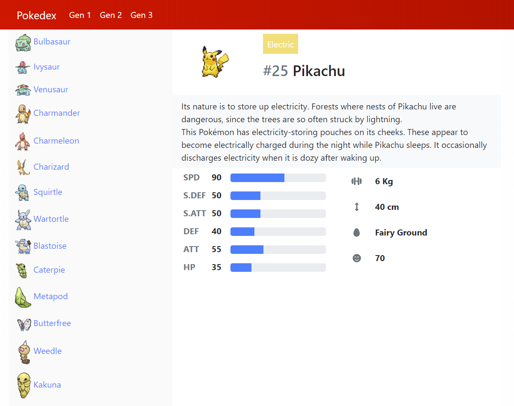

# My Pokedex written in Angular - the Moekedex 

## Getting started
1. Clone project 
2. Run npm installer
`npm install`
3. Start project, open your IDE and start coding
`ng serve -o`

## Data
- https://pokeapi.co/ (data)
- https://projectpokemon.org/images/normal-sprite/ (sprites)

## Preview

